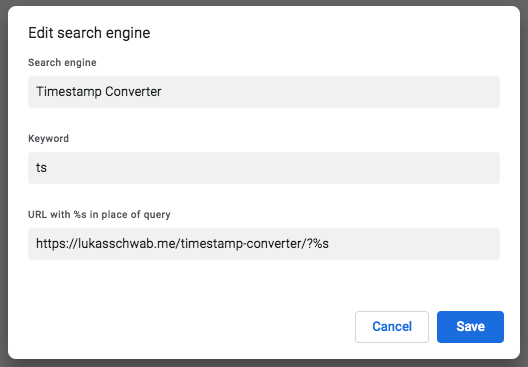

# duration-converter

Some simple duration utilities built around moment.js; essentially a clone of [`timestamp-converter`](https://github.com/lukasschwab/timestamp-converter).

## Search

`duration-converter` provides a naîve router for [defining a Chrome search engine.](https://support.google.com/chrome/answer/95426#edit)

To add this search engine to Chrome, visit `chrome://settings/searchEngines`.

1. Click `Add`, and input the following values:
    + **Search Engine:** Duration Converter
    + **Keyword:** dc
    + **Query URL:** `https://lukasschwab.me/duration-converter/?%s`   
    

2. Click `Add`.

After following these steps, you should be able to type `dc` in the omnibox, hit `Tab`, and then input a duration in one of the supported input forms.
